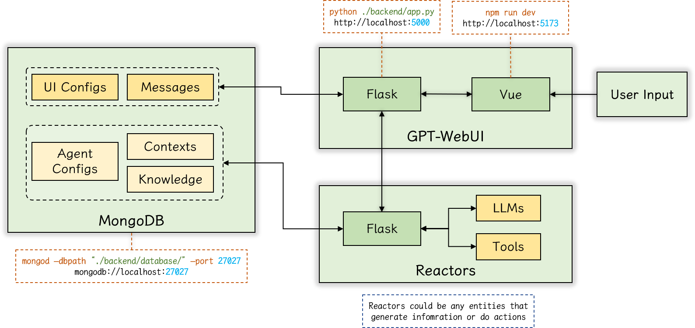

# GPT-WebUI
A clean and powerful web UI for all kinds of GPT-like chat service

# Current UI

Here is the latest interface of the GPT-WebUI:


# Architecture

Here is the architecture of the GPT-WebUI + Reactors + MongoDB:




# npm commands

```sh
npm init vue@latest
```

```
√ Project name: ... GPT-WebUI
√ Package name: ... gpt-webui
√ Add TypeScript? ... Yes
√ Add JSX Support? ... No
√ Add Vue Router for Single Page Application development? ... Yes
√ Add Pinia for state management? ... Yes
√ Add Vitest for Unit Testing? ... No
√ Add an End-to-End Testing Solution? » No
√ Add ESLint for code quality? ... Yes
√ Add Prettier for code formatting? ... Yes
```

```sh
cd GPT-WebUI
npm install 
npm run dev  # localhost:5173
```

## npm packages

```sh
npm install vuetify
npm install vue-sidebar-menu
```